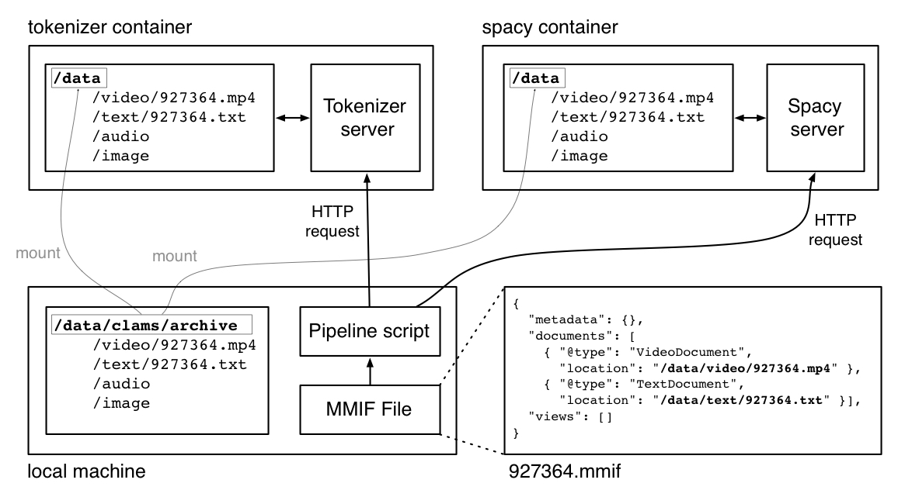

# pipeline-runner

Code to run a CLAMS pipeline from the command line.

Requirements:

- docker and docker-compose
- Python 3, with the `PyYAML` and `requests` packages
- git

```bash
$ pip3 install pyyaml requests
$ git clone https://github.com/clamsproject/pipeline-runner.git
$ cd pipeline-runner
```

In addition you will need access to the applications, either by having the Docker images available locally or by a pull, or by having the repositories for the applications, including the Dockerfile that builds the Docker image.

This documents spells out how to run the pipeline and explains what is going on. If you know what your are doing and you have created a docker compose file all you need to do is run two commands, with the second one resulting in a MMIF file with the results of all processing:

```bash
$ docker-compose up -d
$ python pipeline.py examples/data/mmif/east-tesseract.json out.json
```

More verbosely, there are three parts to this: (1) starting the CLAMS applications, (2) preparing your data and (3) running the pipeline. The rest of this documents focuses on these three steps.

### 1.  Starting the applications

The pipeline runner script in `pipeline.py` assumes there are Docker containers running for each application that is used by the pipeline and that those containers all have access to the same mounted directory. You do this by creating a `docker-compose.yml` configuration file and then running `docker-compose`. Here is an example configuration file (included in this repository in the `examples/docker` directory) :

```yaml
version: '3'

services:
  
  tokenizer:
    container_name: clams_tokenizer
    image: clams-tokenizer
    build:
      dockerfile: Dockerfile
      context: ../app-nlp-example
    volumes:
      - "/data/clams/archive:/data"
    ports:
      - '5001:5000'

  spacy:
    container_name: clams_spacy
    image: clams-spacy
    build:
      dockerfile: Dockerfile
      context: ../app-spacy-nlp
    volumes:
      - "/data/clams/archive:/data"
    ports:
      - '5002:5000'
```

This defines two containers that each run a Flask server on its standard port 5000, but exposing that port under a different port number so we can access all applications. For each service we do six things:

- We give it a name (in this case `tokenizer` or `spacy`).
- We control the name of the container that is created, this comes in handy later.
- We define an image to use in the *image* property (`clams-tokenizer` and `clams-spacy`).  The image will be taken from the local images or pulled from Docker Hub ([https://hub.docker.com/](https://hub.docker.com/)).
- If no image is available then it will be built using the specifications in the *build* property. In this example we assume that the tokenizer and spacy repositories are in sister directories; it is you responsibility to get them there or put them elsewhere and update the *build:context* property. The repositories used here (`app-nlp-example` and `app-spacy-nlp`) are available at [https://github.com/clamsproject](https://github.com/clamsproject). We do not need the *build* property if images are available locally or on Docker Hub. Note that if the image is taken from Docker Hub then the name is likely to be different, for now we just work with local repositories and images.
- We use *volumes* to mount a local directory to a directory on containers created from the image. In the example we mount the local directory `/data/clams/archive` to `/data` on each container. We have some requirements on what is in the mounted directory:
  - It has four subdirectories, one for each document type: `video`, `text`, `audio` and `image`.
  - The subdirectories themselves have no substructure and just contain documents of the particular type that the sub directory is for. At some point this restriction may be relaxed.
- We use *ports* to define the port that will be exposed to the outside world. In the containers, Flask will run on port 5000, but we expose these ports as 5001 and 5002 to the terminal that the pipeline script runs from.

We can now start up all applications:

```bash
$ cp examples/docker/docker-compose-tokenizer-spacy.yml docker-compose.yml
$ docker-compose up -d
```

First we copy the example configuration file to the working directory using the default name, that name will later be used by the pipeline script. The `docker-compose` command pulls or creates images if needed and runs the containers, each of which is a Flask server with access to a CLAMS tool. You can see them listed:

```bash
$ docker ps --format "{{.Ports}}  {{.ID}}  {{.Image}}  {{.Names}}"
0.0.0.0:5001->5000/tcp  0bf79ffe1085  clams-tokenizer  clams_tokenizer
0.0.0.0:5002->5000/tcp  2a80d31b1e02  clams-spacy  clams_spacy
```

You can take down the application and its containers with `docker-compose down`.

#### 1.1.  Including the pipeline script in its own container

We provide an option where the pipeline script runs in its own container. For this you need to make one change to the configuration file and include a pipelining service (here we do not include the other services for brevity, in real life they should be included):

```yaml
version: '3'

services:
  
  pipeline:
    container_name: clams_pipeline
    image: clams-pipeline
    stdin_open: true
    tty: true
    volumes:
      - "/data/clams/archive:/data"
      - "./:/app/host"
    ports:
      - '5000:5000'
```

A few notes:

- In this example we are not including the *build* property and we assume the image is readily available. If needed, adding build information is similar to the example above.
- We need to add the *stdin-open* and *tty* properties to keep the images from immediately exiting.
- The pipelining script probably does not need access to the data to be processed.
- We add a mount point to the orginial script directory so we have access to the docker-compose.yml configuration used to start the services, it will be come clear later why we do this.
- At the moment we do not need a port because we are not (yet) running the pipeline script as a Flask web server. But the script code uses the '5000:5000' mapping to determine that this service is not an element of the pipeline, but the pipeline runner itself, so do not remove or change this property. At some point we may create a Flask server and it will run on port 5000 if we do.

With this added we can enter into the container and run the pipeline from there.

Example docker-compose cofiguration files are in `examples/docker`.


### 2.  Preparing your data

It is important to realize that the input to a pipeline is a MMIF file and not a video, audio, image or text document. The MMIF file refers to those documents but does not include them (even though optionally that might be the case for text documents). This gets a bit tricky when you realize that the MMIF file is sent from the local machine where the pipeline script resides to a server on a container and therefore the documents referred to from the MMIF file must be accessible from the container.

Recall that we mounted `/data/clams/archive` on the docker host to `/data` on the containers. With that in mind you can depict the flow when you run the pipeline script as follows:



The pipeline runs on a MMIF file that points to a video document at`/data/video/927364.mp4 ` and a text document at `/data/text/927364.txt `. Those paths do not exist on the local machine from which you run the pipeline script, but they do exist on the server that the MMIF file is sent to as part of an HTTP request. The files `927364.mp4 ` and `927364.txt` do exist on the local machine, but in a different directory. And that directory is mounted to the `\data` directory on the container with this statement in the docker compose configuration file:

```yaml
    volumes:
      - "/data/clams/archive:/data"
```

Because of that statement, `/data/clams/examples/video/927364.mp4` on the local machine is the same as `/data/video/927364.mp4` on the container. The HHTP request is received by the server, the application code finds the documents locally, does its thing and then returns a MMIF file (that last step is not shown in the figure).

When the MMIF file is created one has to be aware of what the directory structure on the container is. Therefore we require that the mount point is always `\data` and we require that the directory we mount is as specified above with subdirectories for the four document types.

> Ideally, the paths on the local machine and on the container are the same, but that is not always possible, and that is why we end up with a local MMIF file that does not point to existing local paths.

The `clams-python` package has a utility command to create a MMIF file from primary documents.That package is required for CLAMS applications, but otherwise not required for the pipeline script to run. However if you have it installed you can use it for the example above as follows:

```bash
$ clams source video:/data/video/927364.mp4 text:/data/text/927364.mp4 > 927364.json
```

This will create the following file:

```json
{
  "metadata": {
    "mmif": "http://mmif.clams.ai/0.2.1"
  },
  "documents": [
    {
      "@type": "http://mmif.clams.ai/0.2.1/vocabulary/VideoDocument",
      "properties": {
        "mime": "video",
        "location": "/data/video/927364.mp4",
        "id": "d1"
      }
    },
    {
      "@type": "http://mmif.clams.ai/0.2.1/vocabulary/TextDocument",
      "properties": {
        "mime": "text",
        "location": "/data/text/927364.mp4",
        "id": "d2"
      }
    }
  ]
}
```

And this can be used as input to the pipeline script.


### 3.  Running the pipeline script

We can now run the `pipeline.py` script and we can run it in two ways:

1. From the Docker host, where the CLAMS services are all running in there own containers and we access them from the host.
2. From a container, where the pipeline code is running in its own container and we first connect to that container.

#### 3.1.  Running from the docker host

The pipeline script uses the `docker-compose.yml` configuration file to figure out what services are available. You give it a MMIF file as a parameter and optionally a list of services, if no services are given then a default pipeline of services will be created from all available services, ordered on port number. This means that if you carefully define the exposed port numbers in the configuration then the configuration file defines a useful default pipeline.

Use -h to see the available options and arguments:

```bash
$ python pipeline.py -h
usage: pipeline.py [-h] [-v] [-i] [--config CONFIG_FILE] INPUT OUTPUT [PIPELINE [PIPELINE ...]]

positional arguments:
  INPUT                 the input file or directory
  OUTPUT                the output file or directory
  PIPELINE              optional pipeline elements

optional arguments:
  -h, --help            show this help message and exit
  -v, --verbose         print progress messages to standard output
  -i, --intermediate    save intermediate files
  --config CONFIG_FILE  alternative docker-compose file
```

Here is an example where we are using the default pipeline, while writing intermediate files:

```bash
$ python pipeline.py -iv examples/mmif/tokenizer-spacy.json out.json
Processing example-mmif.json
...running tokenizer
...running spacy
$ s -al out*
-rw-r--r--  1 marc  staff  10344 Oct 19 13:41 out-1-tokenizer.json
-rw-r--r--  1 marc  staff  26325 Oct 19 13:41 out-2-spacy.json
-rw-r--r--  1 marc  staff  26325 Oct 19 13:41 out.json
```

And here is one where we define the pipeline explicitly, switching the order relative to the default:

```bash
$ python pipeline.py -iv examples/mmif/tokenizer-spacy.json out.json spacy tokenizer
Processing example-mmif.json
...running spacy
...running tokenizer
$ ls -al out*
-rw-r--r--  1 marc  staff  19097 Oct 19 13:45 out-1-spacy.json
-rw-r--r--  1 marc  staff  26325 Oct 19 13:45 out-2-tokenizer.json
-rw-r--r--  1 marc  staff  26325 Oct 19 13:45 out.json
```

Note the differences in file names and the different file sizes of the intermediate files (because the two services add different amounts of annotations and they are added in different orders now). Also note that this is not much of a pipeline since neither of the two steps depend on the output of the other.

We could also have given just a single step pipeline, in which case there would be only one intermediate output file.

The approach painted here requires that all applications can be loaded at the same time, which in some cases may not always be feasible. If running a complete pipeline runs into memory issues then you can use the pipeline script to successively run one step pipelines over a directory. Assume we have two docker compose scripts, one for just the tokenizer and one for Spacy. We can then run just the first step over all documents:

```bash
$ docker-compose -f docker-compose-tokenizer.yml up -d
$ python pipeline.py --config docker-compose-tokenizer.yml examples/mmif out-tokenizer
```

Followed by running Spacy (after taking down the containers for the previous step):

```bash
$ docker-compose down
$ docker-compose -f docker-compose-spacy.yml up -d
$ python pipeline.py --config docker-compose-spacy.yml out-tokenizer out-spacy
```

In both cases, the docker compose file will have to be handed in so the default is overridden.

#### 3.2.  Running from the docker host

This is very much the same as the above, except for a few differences:

- We should have used a docker compose configuration file that inludes the pipeline. We assume here that all containers are up and running.
- We need to log into the pipeline container.
- We need to make sure we have access to the configuration file.

To enter the pipeline container do:

```bash
$ docker exec -it clams_pipeline bash
```

Recall that in defining the pipeline container in the configuration script we used a volume mount `./:/app/host`. When we enter the container we will be in the `app` directory so in the `host` subdirectoy we have access to everything on the docker host, including the `docker-compose.yml` file. The container itself does not have the configuration file on the expected spot, so we need to use the `--config` option to find it: 


```bash
$ python pipeline.py -v --config host/docker-compose.yml examples/mmif/tokenizer-spacy.json out.json
```

Alternatively, we can copy the file and then run the script without the option:


```bash
$ cp host/docker-compose.yml .
$ python pipeline.py -v examples/mmif/tokenizer-spacy.json out.json
```

