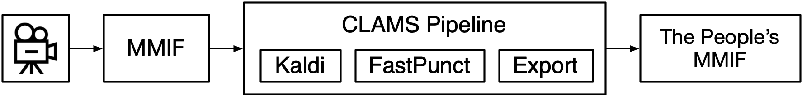
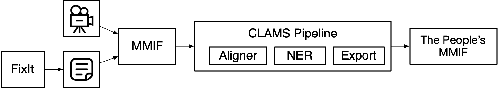
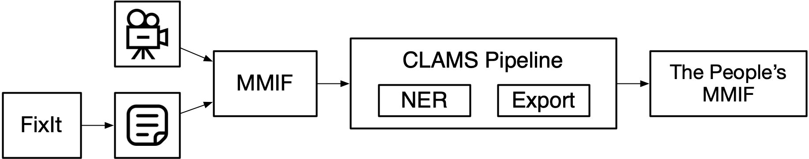

# Notes on Workflows

These are some specifics on how to embed CLAMS pipelines in larger process flows.

The example we are going with is the following:

1. Run a CLAMS pipeline with Kaldi and FastPunct on a video and export the results in a friendlier and more compressed format than MMIF.
2. Pull out the transcript created by Kaldi and create input for the FixIt process.
3. Await the output from the FixIt process.
4. Create a MMIF file with the results of the FixIt process and run a second CLAMS pipeline with just NER and again export the friendly format.

Taking it step by step now.

#### Step 1: Running a CLAMS pipeline with Kaldi

In the first step we create a MMIF file from the video and run a Kaldi pipeline on it that also includes the post-Kaldi component that restores punctuation and capitalization.



The export component creates the more user-friendly format that allows you to easily extract needed information. It has no name yet but for now I will call it the People's MMIF.

#### Step 2: Creating input for FixIt

Let's say that the People's MMIF has some JSON objects as follows (start and end times all made up):

```json
{ "id": "t1", "start": "36.54", "end": "37.13", "text": "really" },
{ "id": "t2", "start": "37.13", "end": "37.42", "text": "its" },
{ "id": "t3", "start": "37.42", "end": "38.25", "text": "people" },
{ "id": "t4", "start": "38.25", "end": "39.54", "text": "students" },
{ "id": "t5", "start": "39.54", "end": "40.54", "text": "staff" },
{ "id": "t6", "start": "40.54", "end": "41.10", "text": "love" }
```

This could be elements of a much longer list that is nicely marked as being the tokens from the transcript. In MMIF there would be a bunch of annotations of type Token, a bunch of annotations of type TimeFrame and a bunch of annotations of type Allignment that aligns the tokens to the time frames.

And let's assumes that the input for FixIt corresponding to the above looks as follows (taking a guess given the examples in the shared Google directory with transcripts):

```json
{
  "id": 25274012,
  "text": "really its people students staff love",
  "start_time": "36.54",
  "end_time": "41.1",
  "speaker_id": 978794
}
```

It is obvious that it would be easy to create this from the People's MMIF, except that we do not have any speaker identifiers. One issue is to decide on a phrase size and it looks like we can just pick any random size, but maybe the FixIt process implicitly imposes some boundaries there.

#### Step 3: Awaiting the output from FixIt

Easy, we just wait, and at some point we get something like the following:

```json
{
  "id": 39434,
  "start_time": 36539,
  "end_time": 41100,
  "original_text": "really its people students staff love",
  "text": "really its people, its students, staff, alumni,",
  "guess_text": "really its people, its students, staff, alumni,",
  "sequence": 2,
  "transcript_line_status_id": 4,
  "speaker_id": 0,
  "flag_count": 0
}
```

There seems to be a change in the time unit, which the workflow manager should be aware of.

#### Step 4: Running the second CLAMS pipeline

First we take the FixIt output and create a text document for the entire fixed transcript, which for this example is as simple as lifting the text filed out of the JSON file and storing it in its own file. In realtity there is more than one phrase as above so we need to lift out the text property of all of them and concaternate them.

Now we have three files: the original video file, the JSON file created as input to the FixIt process, the JSON file returned from FixIt, and the text file created from the FixIt output:

```
111-4298sn9.mp4
111-4298sn9-fixit-in.json
111-4298sn9-fixit-out.json
111-4298sn9-fixit-out.txt
```

Then we can create the MMIF file using just the video and text file:

```json
{
  "metadata": {
    "mmif": "http://mmif.clams.ai/0.4.0"
  },
  "documents": [
    {
      "@type": "http://mmif.clams.ai/0.4.0/vocabulary/VideoDocument",
      "properties": {
        "mime": "video",
        "location": "/data/111-4298sn9.mp4",
        "id": "d1"
      }
    },
    {
      "@type": "http://mmif.clams.ai/0.4.0/vocabulary/TextDocument",
      "properties": {
        "mime": "text",
        "location": "/data/111-4298sn9-fixit-out.txt",
        "id": "d2"
      }
    }
  ]
}
```

And now we can run another pipeline, the diagram for this entire step looks as follows.




Note that the result of step 3 did not have any alignments on the token level and that we ran the aligner to reintroduce those. An alternative would be to not require alignment on the token level and be happy with the phrase alignment. In that case we would complicate the creation of the MMIF file a bit because we would want to add a view with text spans and alignments:

```json
{
  "id": "v1",
  "metadata": {},
  "annotations": [
    {
      "@type": "http://mmif.clams.ai/0.4.0/vocabulary/Span",
      "properties": {
        "id": "s1",
        "text": "really its people, its students, staff, alumni,",
        "start": 243,
        "end": 290 }
    },
    {
      "@type": "http://mmif.clams.ai/0.4.0/vocabulary/TimeFrame",
      "properties": {
        "id": "tf1",
        "start": 36539,
        "end": 41100 }
    },
    {
      "@type": "http://mmif.clams.ai/0.4.0/vocabulary/Alignment",
      "properties": {
        "id": "a1",
        "source": "tf1",
        "target": "t1" }
    }
  ]
}
```

And now the pipeline can be shortened:




